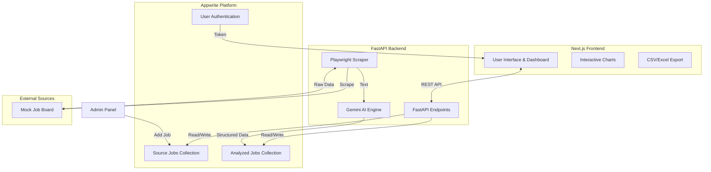

# Architecture Diagram

```mermaid
graph TD
    subgraph Frontend ["Next.js Frontend"]
        UI[User Interface & Dashboard]
        Charts[Interactive Charts]
        Export[CSV/Excel Export]
    end

    subgraph Backend ["FastAPI Backend"]
        API[FastAPI Endpoints]
        Scraper[Playwright Scraper]
        AIEngine[Gemini AI Engine]
    end

    subgraph Database ["Appwrite Platform"]
        Auth[User Authentication]
        SourceDB[Source Jobs Collection]
        AnalyzedDB[Analyzed Jobs Collection]
    end

    subgraph External ["External Sources"]
        JobBoard[Mock Job Board]
    end

    UI <-->|REST API| API
    API -->|Read/Write| SourceDB
    API -->|Read/Write| AnalyzedDB
    Auth -->|Token| UI

    Admin[Admin Panel] -->|Add Job| SourceDB
    Scraper -->|Scrape| JobBoard
    JobBoard -->|Raw Data| Scraper
    Scraper -->|Text| AIEngine
    AIEngine -->|Structured Data| AnalyzedDB
```
